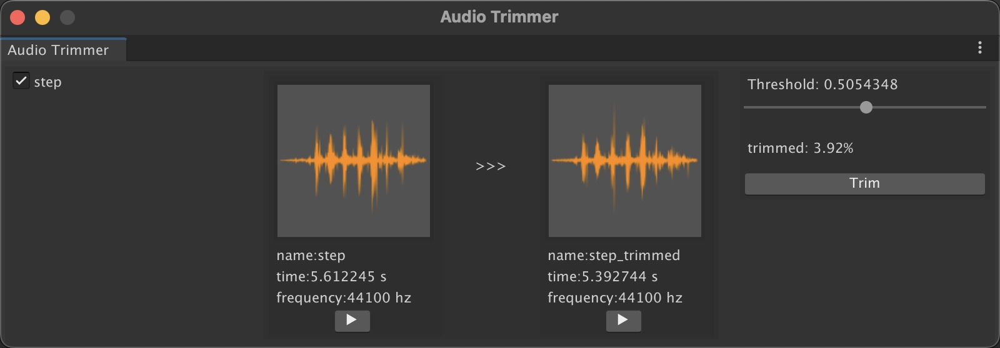

# UnityToolSet
Some Tools for Unity3D.

## DependencyViewer
Clearly visualize the dependencies of assets.   

* Example   
     

## AudioTrimmer
Delete the white space in the front and back sections of the audio file.

* Example   
    